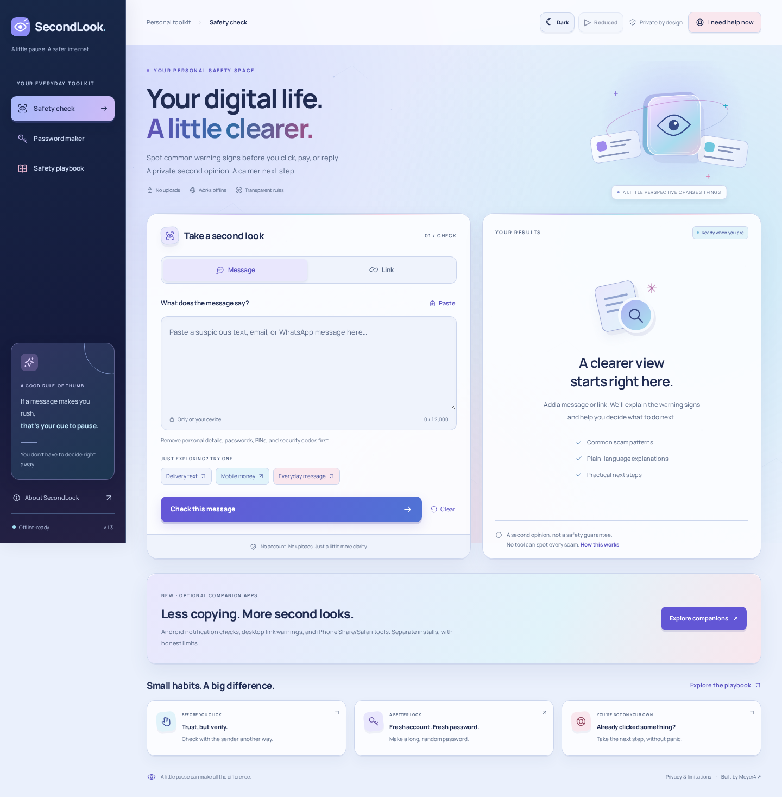
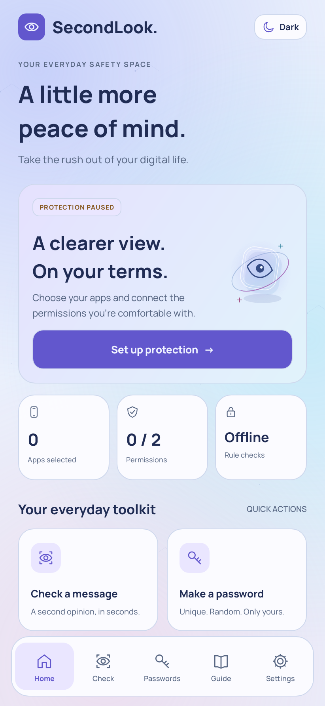
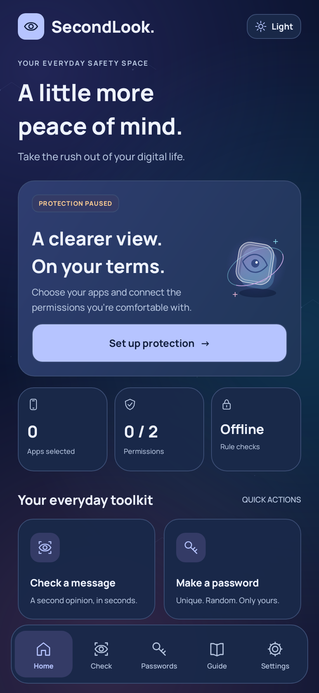

# SecondLook

### A little pause. A safer internet.

**[Open SecondLook](https://meyer4.github.io/secondlook/)** · **[Source repository](https://github.com/Meyer4/secondlook)**



A privacy-first web app that helps people take a second look at suspicious messages and links, generate unique passwords, and find practical incident-response steps.

**No account. No paid API. No backend. No submitted-message uploads.**

> **Important:** SecondLook is a local, rule-based educational tool—not an antivirus, an AI fraud detector, a threat-reputation service, or a safety certificate. False positives and missed scams are expected. “No common warning signs found” never means “safe.” English-language message patterns are the focus of version 1.

## New: optional companion apps (1.3.0 Prism preview)

**[Get the companions and setup guide](https://meyer4.github.io/secondlook/companions.html)**

- **Android:** user-enabled, per-app notification text checks, private local warnings, duplicate suppression, cooldowns, Share checks, passwords, and an offline playbook. No Internet permission.
- **Desktop Chrome/Edge:** optional site access, supported link-click warnings, manual/context-menu checks, and optional rate-limited browser notifications.
- **iPhone:** native Share/check/password/playbook source plus Safari extension source. Apple signing is needed; this is not a browser-installable iOS app or an App Store release.

These do **not** read every private message or intercept every link. No physical-device battery measurement or universal coverage is claimed. Read **[the companion documentation](companions/README.md)** and **[verification status](companions/VERIFICATION.md)** before installing a preview.

[](https://github.com/Meyer4/secondlook/actions/workflows/companions.yml)

## 1.3 Prism: depth, colour, and a choice of light or dark

The Android app and web dashboard now share a multicolour Prism design: violet, cyan, blue, and rose; dimensional glass-eye graphics; optional live backgrounds; and working light/dark modes. The approved layout, local typography, and organised navigation remain. Android shows actual setup state—not a fabricated “security score”. Read the [Prism design and verification notes](docs/PRISM-1.3.md).

The distributable Android preview is non-debuggable and uses a separate preview package identity. It is not an in-place update for the original temporary-key APK. Review the installation notes before enabling both versions.

<p> </p>

*Native-graphics test renders, not physical-device screenshots.*

[Read the focused security review](docs/SECURITY-REVIEW-1.2.md): bounded/malformed native input handling, real-user browser activation, restrictive client CSP, least-privilege deployment, SHA-pinned Actions, regression tests, and configured code scanning. **No unhackable, independent-audit, or zero-vulnerability claim is made.**

## What is included

| Tool | What it does |
|---|---|
| Message check | Looks for common pressure tactics, requests for secrets, advance fees, unusual payment demands, remote-access requests, mistaken mobile-money transfers, and other defined patterns. |
| Link check | Uses the browser’s URL parser to show the exact hostname. Checks for user-info tricks, HTTP, numeric hosts, internationalised domains, known shorteners, selected brand wording, installer-like paths, and possible redirect parameters. **Never visits a submitted URL.** |
| Password maker | Generates 12–40-character passwords in the UI using `crypto.getRandomValues`, unbiased selection, and optional character groups. The library supports lengths up to 64. No weak-random fallback. |
| Safety playbook | Incident-specific guidance for a clicked link, a payment, a shared password or code, installed software, or impersonation. Includes a locally saved, non-sensitive checklist. |
| Private sharing | Copies an explanatory summary without the original message, full URLs, or quoted evidence. Hostnames and descriptions may still be included. |
| Offline support | A scoped service worker caches the hosted app after a successful first load. All core tools then work offline. |

Fictional scam examples use the reserved `.example` domain. The ordinary-link and shortener examples are never opened or followed.

## Run it locally

Use Node.js 20 or newer:

```bash
npm run dev
```

Open **http://localhost:5173**. Runtime dependencies are not required. The included development server binds to `0.0.0.0` and accepts preview hosts.

Alternatively, serve the `site/` directory with any static web server. Use a local web server rather than double-clicking `site/index.html`, because the source app uses JavaScript modules.

## Publish the code AND the live app

See **[DEPLOY.md](DEPLOY.md)** for secure browser-based and GitHub CLI instructions.

The included GitHub Actions workflow:

1. Runs the unit tests on a push to `main`.
2. Uploads **only the `site/` directory** as the website artifact.
3. Deploys it to GitHub Pages.

Enable **Settings → Pages → Source → GitHub Actions** in the repository. Then run **Actions → Test and deploy SecondLook → Run workflow** if the initial push happened before Pages was enabled.

With a repository named `secondlook`, the expected address is:

```text
https://YOUR-GITHUB-USERNAME.github.io/secondlook/
```

That format is an example for your own fork. This project’s configured address is **https://meyer4.github.io/secondlook/**. The workflow must succeed before a new deployment is live. Any workspace preview is temporary development hosting, not permanent GitHub hosting.

## Test it

The unit tests use only Node’s built-in test runner:

```bash
npm test
```

Browser, privacy, offline, responsive-layout, and automated accessibility checks:

```bash
npm ci
npx playwright install --with-deps chromium
npm run test:browser
```

Automated accessibility checks do not replace manual testing with assistive technology. The current browser suite targets Chromium; cross-browser verification remains recommended before broad production use.

## Project structure

```text
site/
  index.html                 Semantic interface and dialogs
  styles.css                 Responsive, self-contained styling
  app.js                     UI state, navigation, clipboard and checklist
  lib/scanner.js             Pure local message and URL checks
  lib/passwords.js           Cryptographic password generation
  lib/playbook.js            Shared offline incident guidance
  companions.html            Companion downloads and honest setup limits
companions/                  Android, desktop browser, and iPhone/Safari projects
shared/                      Exported native rules and 30 common test vectors
  sw.js                      Scoped offline asset cache
  manifest.webmanifest       Installable web-app metadata
  assets/                    Local font, icons, and font licence
tests/
  scanner.test.js            Pattern and URL unit tests
  passwords.test.js          Random generation unit tests
  browser/toolkit.spec.js    End-to-end and accessibility checks
.github/workflows/deploy.yml GitHub Pages deployment
scripts/bundle.py            Single-file preview and clean source ZIP
server.mjs                  Local static development server
```

## Privacy and security design

- Check input and generated passwords are held in page memory, not written to storage or sent to a server.
- Only checklist booleans are saved in `localStorage`, under `secondlook:habits:v1`.
- No analytics, ads, third-party scripts, external fonts, or runtime API calls.
- Inputs are rendered using DOM text nodes, not interpolated HTML.
- Submitted addresses are displayed as non-clickable text and are never fetched.
- A Content Security Policy disallows app connections and external resources.
- Password generation uses rejection sampling; it fails closed when secure randomness is unavailable.
- The web host can log normal page/asset requests. Browser extensions, malware, OS clipboard history, and browser session restoration are outside this app’s control.

See **[SECURITY.md](SECURITY.md)** and **[PRIVACY.md](PRIVACY.md)** for the threat model and limitations.

## Good next projects for a CS / cybersecurity student

1. **Measure false positives and misses.** Build an ethically collected, de-identified test set and publish limitations instead of inventing an “accuracy” figure.
2. **Add real language support.** Work with native speakers on Chichewa and other languages. Translating the interface alone does not translate the detection rules.
3. **Improve domain interpretation.** Add a maintained Public Suffix List and carefully tested, contextual international-domain checks. A strange-looking domain is not proof of fraud.
4. **Add country-specific reporting guidance.** Verify official channels and avoid collecting victims’ personal documents.
5. **Optional reputation checks, with informed consent.** This would change the privacy model and require a protected backend, rate limits, provider terms, and clear disclosure. Never put API secrets into this static client.
6. **Independent review.** Test with users, accessibility tools, security reviewers, and additional browsers before presenting it as a mature product.

## Licence and attribution

Project code and original interface artwork: **MIT**, see [LICENSE](LICENSE).

The bundled **Manrope** variable font is distributed under the SIL Open Font License 1.1; its full notice is in `site/assets/Manrope-OFL.txt`. Source: the [Google Fonts Manrope repository](https://github.com/google/fonts/tree/main/ofl/manrope). The font is served locally; users’ browsers do not contact Google Fonts.
